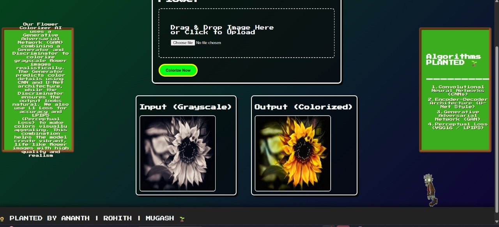

<h1 align="center">🎨 Chromatic Resurrection</h1>

<h3 align="center">
AI-assisted restoration and colorization of grayscale flower images
</h3>

<p align="center">


</p>

---

# 🌍 About The Project

**Chromatic Resurrection** is an image restoration and colorization project designed to transform grayscale flower images into visually realistic colored outputs.

The system applies machine learning-based pixel prediction techniques to reconstruct missing color information while preserving image structure and details.

---

# 🚀 Project Goal

Convert:

⚫ Black & White Images

into

🌸 Realistic Colored Images

using AI-assisted image processing methods.

---

# ✨ Features

✔ Grayscale → Color image transformation

✔ Image restoration

✔ Enhancement of visual appearance

✔ Side-by-side comparison view

✔ Web interface for interaction

✔ Prediction-based color reconstruction

---

# 🧠 Methodology

Current implementation uses:

```text
Patch-based Multiple Linear Regression
```

for grayscale-to-color prediction.

Future enhancements proposed:

- GAN
- CNN Encoder–Decoder
- U-Net
- Pix2Pix
- Attention-based models

---

# 🛠 Tech Stack

Core:

Python • OpenCV • NumPy • Scikit-learn

Visualization:

Matplotlib

Web:

Flask • HTML • CSS • JavaScript

---

# 📂 Dataset

Dataset source:

Kaggle flower image colorization datasets

Approx training size:

Large-scale image dataset (18~GB-level training data)

Possible datasets:

- Flower image colorization
- Image restoration datasets


---

# 📊 Evaluation Metrics

Project evaluated using:

| Metric | Purpose |
|--------|----------|
| MSE | Error measurement |
| R² Score | Regression quality |
| PSNR | Image reconstruction quality |

---

# 🖼 Results

## UI Interface



---

# 🔬 Research Direction

Potential future expansion:

✔ GAN-based colorization

✔ CNN image reconstruction

✔ U-Net segmentation pipelines

✔ Improved realism generation

---

# 🌐 Deployment

Current status:

Local Flask deployment

Public deployment:

Not yet available

---

# 📈 Project Impact

This work explores:

Computer Vision

Image Restoration

Machine Learning

AI-assisted media reconstruction

---

# 👥 Team Members

**Mugash Priyan U**

**Ananthanarayana M**

**Rohith S**

---

# 👨‍💻 Developer Notes

Completed as an academic AI/ML project with scope for deep learning enhancement.

---

⭐ If you found this project interesting, consider starring the repository.
